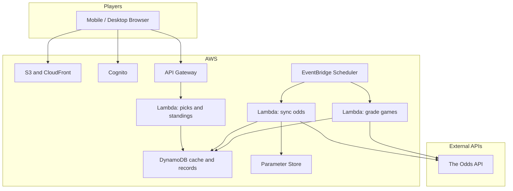

# NFL Locks Web App Plan

## Project status

Last updated: August 10, 2026.

- **Phase 1 is complete and deployed.**
- **Phase 2 is complete and deployed for preseason Week 1.**
- Production application: https://d141pq884g4gai.cloudfront.net
- AWS account: `580956784928`
- AWS region: `us-east-1`
- Cognito login, authenticated APIs, live odds sync, pick submission, and the
  current-week UI have been validated end to end.
- GitHub Actions deploys `LocksAppStack` from `main` through short-lived OIDC
  credentials.
- Foundation and application deployments use separate, least-privilege roles
  and runtime permissions boundaries.
- The current Cognito user is `kenneth.huebsch@gmail.com`.
- Preferred sportsbook: **DraftKings** (`draftkings` bookmaker key).
- No AWS Budget exists by user choice; spending is monitored manually.
- AWS CLI v2 and CDK are available in Mira's container; deployment uses
  `coding-agent` and `locks-publish` IAM profiles.
- `LocksAppPublishRole` enables container-based static publishing and operator
  data/Cognito tasks.
- `LocksCodingAgentReadPolicy` grants read-only DynamoDB, CloudFormation,
  Scheduler, Lambda config, logs, and IAM inspection from the container.

### Phase 2 completion status

- [x] DynamoDB data model documented in `docs/data-model.md`
- [x] Shared types, NFL team mappings, and DynamoDB key patterns
- [x] Odds API client with quota tracking and circuit breaker
- [x] Odds API key set in SSM Parameter Store
- [x] `sync-odds` Lambda with EventBridge schedules enabled
  (`sync-odds-morning` 12:00 UTC / `sync-odds-afternoon` 20:00 UTC)
- [x] Live preseason source: `americanfootball_nfl_preseason`
- [x] `current-week` API endpoint (`GET /api/week/current`)
- [x] Atomic pick submission (`POST /api/picks`) with validation
- [x] Frontend: game cards, pick flow, confirmation modal, picks board
- [x] Auto-refresh of picks board
- [x] Kickoff ordering ascending with preseason day groups
- [x] DraftKings preferred sportsbook locked
- [x] Foundation dummy game removed from publish path and cleaned from live table
- [ ] Jack Cognito account created (need email address)
- [ ] Eric Cognito account deferred (not inviting yet)
- [x] Phase 2 end-to-end validation with real preseason game data

### Current open items

1. **Jack invite:** need Jack's email to create a Cognito user and map roster `sub`.
2. **Eric invite:** deferred until Kenny asks.
3. **Phase 3 next:** score sync, grading, standings, historical results board.

## Recommendation: AWS serverless with DynamoDB caching

Use AWS serverless rather than Lightsail:

- S3 + CloudFront host the React app.
- Cognito provides invite-only login.
- API Gateway + Lambda serve authenticated APIs.
- DynamoDB stores players, games, picks, standings, cached odds, and API quota usage.
- EventBridge Scheduler triggers odds synchronization and grading.
- Systems Manager Parameter Store holds the Odds API key.

At three users, expected AWS usage is far below the published free allowances for Lambda, DynamoDB, and EventBridge. CloudFront, S3, and API Gateway may incur small charges, but expected cost is approximately $0–1/month.

AWS spending will be monitored manually. A Budget alert was intentionally not
created.

AWS does not reduce The Odds API usage by itself; caching was already planned. It removes Netlify/Airtable dependencies and gives us control over caching, schedules, and retention.

## Current workflow

Based on `lockgen.py`, the spreadsheet, and the generated HTML:

- Three competitors: Kenny, Jack, and Eric.
- Each player selects three teams against the spread each week.
- The selected spread is recorded alongside the team.
- Results are recorded as win, loss, or push.
- Season and weekly W-L-T records are displayed.
- Historical seasons through 2025 remain on inov8.cc.
- The app starts with the next season or launch week.
- K/D badges will not carry over.

## Architecture



In Phase 2, the Odds API key will live in Parameter Store and will be readable
only by the synchronization Lambda role. Phase 1 provisions the exact access
boundary but does not create the parameter value. The browser never talks
directly to DynamoDB or The Odds API. Cognito JWTs protect every API route.

## Competition rules

1. Spread locks at pick time.
   - Save `picked_team` and `spread_at_pick` when the pick is submitted.
2. Each game has its own deadline.
   - A game becomes unavailable when its kickoff time passes.
   - Players can still choose later games if earlier games have started.
3. Submitted picks are immediately visible.
   - Every logged-in player can see a pick as soon as it is submitted.
4. Submitted picks are final.
   - A pick cannot be changed or deleted.
   - A player can submit additional picks later until reaching three.
5. Maximum three picks per player per week.
   - Picks may be submitted incrementally.
6. Results are graded automatically.
   - Finished games produce win, loss, or push results using the locked spread.
7. Standings use W-L-T only.
   - K/D badges are removed.

## DynamoDB data model

Use one DynamoDB table with explicit partition and sort keys plus focused
secondary indexes. Phase 1 created the encrypted table and a minimal seeded game
shape. Final Phase 2 key patterns must be documented in `docs/data-model.md`
before implementing picks or odds caching.

### Players

- `name`
- `display_name`
- `avatar_url` (optional)
- `identity_email`, mapped to Cognito

### Seasons

- `year`
- `is_active`

### Weeks

- `season_id`
- `week_number`, 1–18
- `status`: open, grading, or complete

### Games

- `season_week`
- `odds_event_id`
- `away_team`
- `home_team`
- `away_abbr`
- `home_abbr`
- `commence_time` in UTC
- `away_spread`
- `home_spread`
- `away_score`
- `home_score`
- `status`: scheduled, in progress, or final
- `bookmaker`

### Picks

- `player_id`
- `game_id`
- `season_week`
- `picked_team`
- `spread_at_pick`
- `submitted_at`
- `result`: pending, win, loss, or push

A DynamoDB transaction will:

1. Conditionally insert the pick.
2. Reject an existing player/game combination.
3. Increment the weekly pick count only if it is below three.

Player-facing update and delete operations will not exist. Only the grading Lambda can update a pick’s result.

### API usage

- `timestamp`
- `endpoint`
- `credits_used`
- `credits_remaining`

Old usage records will expire through DynamoDB TTL after a short diagnostic period.

## Application pages

### Login

- Cognito invitation-only accounts.
- Public registration disabled.
- Redirect authenticated users to the current week.

### Weeks navigation

- Single **Weeks** dropdown in the header (no separate This Week / Picks Board tabs).
- Default selection is the current week.
- **Current week:** pick-entry view only (WeekView).
- **Past weeks:** Picks Board for that week only (read-only).
- Until historical week APIs ship, the UI can run on mock three-week demo data via `VITE_USE_MOCK_WEEKS` (default on unless set to `false`).

### Current week (pick entry)

- Display the player’s current record.
- Display the number of remaining picks.
- Prominent notice:

> Picks are final once submitted — you cannot change them.

- Group game cards by Thursday, Sunday early, Sunday late, and Monday.
- Each card displays:
  - Away and home teams
  - Kickoff time in Eastern Time
  - Current cached spread
  - Last odds update time
- Exactly one pending selection at a time: tap a team to select, tap again to clear, tap another team to move the selection.
- Sticky singular **Submit pick** after selection; confirmation modal before lock-in.
- Started games are disabled.
- Previously picked games show the locked team and spread in read-only mode.

Before submission, show a confirmation modal:

> This cannot be undone. Lock in this pick?

The submission API validates:

- The game has not started.
- The player has not already picked the game.
- The player has fewer than three weekly picks.
- The submitted team and spread match the current cached game data.

After submission:

- Show the locked pick and spread.
- Show a lock icon.

### Standings

- Season W-L-T leaderboard.
- Weekly records.
- Optional current-week scoreboard as games finish.

### Picks Board (past weeks)

- Shown when a past week is selected in the Weeks dropdown.
- Multi-player table of submitted picks for that week’s games.
- All submitted picks visible immediately.
- Result colors:
  - Win: green
  - Loss: red
  - Push: yellow
  - Pending: neutral

## API and Lambda functions

### User APIs

- `GET /api/week/current`
  - Current games and every submitted pick for the week.
- `POST /api/picks`
  - Insert new immutable picks.
  - Reject duplicates, edits, started games, and selections beyond the weekly limit.
- `GET /api/standings`
  - Season and weekly records.
- `GET /api/picks/history`
  - Full season picks board.

### Scheduled functions

- `sync-odds`
  - Fetch the NFL slate in one bulk request.
  - Update cached games and spreads in DynamoDB.
  - Track API quota consumption.
- `grade-games`
  - Fetch completed scores.
  - Update game records.
  - Grade pending picks.

## Grading logic

For an away-team pick with a locked spread of `+6.5`:

```text
adjusted_score = away_score + 6.5
```

- Win if `adjusted_score > home_score`
- Push if `adjusted_score == home_score`
- Loss otherwise

Apply the equivalent calculation when the selected team is the home team.

## Odds API free-tier strategy

The goal is to remain below 500 credits every month.

### API costs

- Events endpoint: 0 credits
- NFL odds with one region and spreads only: 1 credit
- Scores with completed games requested: 2 credits
- Browser page loads: 0 vendor credits

Odds requests use only:

- Region: `us`
- Market: `spreads`
- One bulk request for the entire NFL slate

### Caching requirements

1. DynamoDB is the cache.
2. The browser never calls The Odds API.
3. Never request odds separately for each game.
4. Use the free events endpoint when only schedule information is needed.
5. Record quota headers after every metered response.
6. Stop synchronization when fewer than 50 credits remain.
7. Disable schedules during the offseason.
8. Display the last odds update time to users.

### Odds schedule

- Tuesday–Wednesday: once daily
- Thursday–Monday: twice daily
  - Morning
  - Approximately two hours before the first kickoff

Estimated cost: approximately 40–50 credits/month.

### Score schedule

- Sunday: after early games, late games, and Sunday Night Football
- Monday: after Monday Night Football
- Thursday: after Thursday Night Football

Estimated cost: approximately 32–40 credits/month.

### Monthly estimate

Using The Odds API for spreads and scores:

- Approximately 80–90 credits/month
- Approximately 410 credits of buffer

Optional later optimization:

- Use a separate free NFL score source for grading.
- Reserve The Odds API exclusively for spreads.
- This would reduce usage to approximately 40–50 credits/month.
- The tradeoff is maintaining a second external integration.

The initial implementation will use The Odds API for both because it is simpler and still comfortably below the free limit.

### Enforcement

- One shared Odds API client controls allowed endpoints.
- Store quota usage in DynamoDB.
- Check quota before scheduled calls.
- Stop calls below the configured reserve.
- Add `ODDS_API_ENABLED=false` as an emergency/offseason kill switch.
- Show “Lines last updated…” in the UI.

## Technology stack

- React
- Vite
- TypeScript
- Tailwind CSS
- Amazon S3
- Amazon CloudFront
- Amazon Cognito
- API Gateway HTTP API
- AWS Lambda
- Amazon DynamoDB
- EventBridge Scheduler
- Systems Manager Parameter Store
- AWS CDK in TypeScript
- GitHub Actions using AWS OIDC
- No long-lived AWS credentials in GitHub

## Proposed repository structure

```text
locks/
  src/                 # React application
  backend/functions/   # API and scheduled Lambda handlers
  infrastructure/      # AWS CDK stacks
  shared/              # Types, grading logic, team mapping
  docs/data-model.md   # DynamoDB keys and indexes
```

## Implementation phases

### Phase 1: Foundation — complete

- [x] Scaffold React, Vite, TypeScript, and Tailwind.
- [x] Add tested TypeScript CDK infrastructure.
- [x] Provision private S3, CloudFront, Cognito, API Gateway, Lambda,
  DynamoDB, and EventBridge Scheduler resources.
- [x] Provision exact future Parameter Store access without creating a fake
  Odds API key.
- [x] Configure GitHub Actions deployment through branch-restricted AWS OIDC.
- [x] Separate foundation and application deployment identities.
- [x] Apply least-privilege execution policies and a runtime permissions
  boundary.
- [x] Create the initial invite-only Cognito account.
- [x] Seed a dummy game and validate the authenticated flow end to end.
- [x] Document human and agent infrastructure operations.

Approved Phase 1 deviations:

- No AWS Budget alert; spending is monitored manually.
- One Cognito account was created initially. Jack and Eric remain pending until
  their email addresses are supplied.
- The Odds API parameter value is deferred until Phase 2.

### Phase 2: Picks and odds — complete

- Document final DynamoDB keys, indexes, transactions, and TTL records in
  `docs/data-model.md`.
- Add the approved Odds API key to Parameter Store without exposing it to the
  browser, logs, GitHub, or source control.
- Create Jack and Eric's Cognito accounts when their email addresses are
  available.
- Implement the scheduled odds synchronization Lambda.
- Cache games and spreads in DynamoDB.
- Add free-tier quota tracking and the circuit breaker.
- Add NFL team-name and abbreviation mappings.
- Implement atomic pick submission.
- Enforce:
  - Spread snapshot
  - Per-game deadline
  - Immutable picks
  - Three-pick weekly maximum
- Refresh shared picks after submission, on window focus, and at a short interval.

### Phase 3: Grading and standings — planned

- Implement scheduled score synchronization.
- Implement W-L-P grading.
- Build season and weekly standings.
- Build the historical picks board.

### Phase 4: Polish and final release — planned

- Complete the mobile UX pass.
- Display kickoff times in Eastern Time.
- Add empty states.
- Reinforce immutable-pick messaging.
- Add admin-only grading overrides for postponed games and unusual outcomes.
- Admin overrides cannot edit player picks.
- Deploy the completed version-one application changes to the existing
  production infrastructure.
- Optionally link to it from inov8.cc.

## Required from you

Completed:

1. AWS account: `580956784928`.
2. Target AWS region: `us-east-1`.
3. Initial CDK/OIDC deployment access.
4. Kenny's invite-only Cognito account and login validation.
5. Offseason/foundation validation using a dummy 2026 Week 1 game.

Still needed for multiplayer:

1. Free-tier Odds API key.
2. Jack's email address for Cognito invitation (Eric deferred).
3. Preferred sportsbook: **DraftKings** (confirmed).
4. Confirm whether the real launch target is 2026 Week 1 or an earlier test
   window.

## Risks and mitigations

- **Odds quota exhaustion**
  - Quota tracking, conservative schedules, reserve threshold, and kill switch.
- **Stale odds**
  - Show the last update time and synchronize before major kickoff windows.
- **Team-name mismatches**
  - Reference games by vendor event ID rather than free-text team names.
- **Postponed games**
  - Keep picks pending and provide a grading override.
- **API outage**
  - Continue displaying cached lines and provide a manual grading fallback.
- **Unexpected AWS charges**
  - Use only serverless resources, monitor billing manually, and avoid NAT
    Gateway or always-on compute.
- **Concurrent or repeated submissions**
  - Use DynamoDB conditional transactions to enforce uniqueness, immutability, and the weekly limit atomically.

## Out of scope for version one

- Importing historical 2025 picks
- K/D crown badges
- Survivor pool
- Office Football Pool
- Anonymous public access
- Player pick editing or deletion
