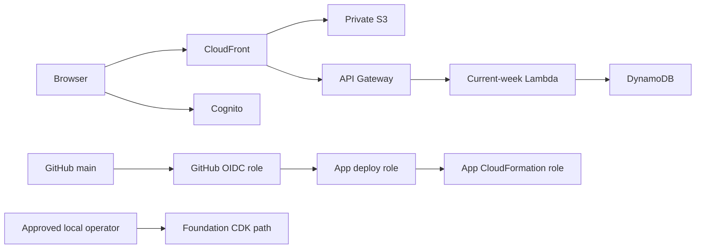

# Locks

Phase 1 is a serverless foundation for the NFL Locks app. It provides an
invite-only Cognito login, a JWT-protected current-week API, and one
idempotently seeded game. Picks, odds, grading, and standings are intentionally
out of scope.

## Current deployment

| Item | Value |
|---|---|
| Application | https://locks.inov8.cc |
| CloudFront fallback | https://d141pq884g4gai.cloudfront.net |
| AWS account | `580956784928` |
| AWS region | `us-east-1` |
| Production branch | `main` |
| Login | Invite-only Cognito managed login |
| Current user | `kenneth.huebsch@gmail.com` |
| Data | One manually seeded 2026 Week 1 game |

The production flow has been validated through Cognito login, required password
change, authenticated API access, and game display.

## Architecture

- React, Vite, TypeScript, and Tailwind CSS
- Private S3 origin behind CloudFront
- Cognito managed login using Authorization Code and PKCE
- API Gateway HTTP API with a Cognito JWT authorizer
- Lambda and encrypted DynamoDB
- EventBridge Scheduler group and a future Lambda execution role
- GitHub Actions deployment using repository- and branch-restricted OIDC

All AWS resources are defined in `LocksGitHubOidcStack` and `LocksAppStack`.
The target is fixed to account `580956784928` in `us-east-1`.



The foundation and application use separate deployment identities. GitHub can
deploy only `LocksAppStack`; it cannot assume the generic CDK bootstrap deploy
role or change the OIDC foundation. Application runtime roles are capped by a
permissions boundary.


## Frontend navigation (current UX)

- Header **Weeks** dropdown defaults to the current week.
- Current week: single-pending-pick entry UI.
- Past weeks: read-only Picks Board for that week.
- Demo path: mock weeks 1–3 when `VITE_USE_MOCK_WEEKS` is not `false` (no historical API yet).

## Repository guide

- `src/`: React application
- `backend/functions/`: Lambda handlers
- `shared/`: shared API and fixture types
- `infrastructure/`: TypeScript CDK stacks and assertions
- `scripts/`: guarded publishing, configuration, and seeding
- `.github/workflows/deploy.yml`: OIDC deployment from `main`
- `PLAN.md`: product roadmap and later phases
- `AGENTS.md`: mandatory rules for coding agents
- `.agent/skills/managing-locks-infrastructure/`: agent infrastructure runbook

## Local verification

Use Node.js 22 or newer.

```powershell
npm ci
npm run lint
npm run typecheck
npm test
npm run build
```

CDK synthesis resolves the current AWS identity. Set the approved profile and
run the account guard first:

```powershell
$Profile = "kenneth.huebsch@gmail.com"
$ExpectedAccount = "580956784928"
$Account = aws sts get-caller-identity --profile $Profile --query Account --output text
if ($Account -ne $ExpectedAccount) { throw "Expected AWS account $ExpectedAccount, received $Account" }
$env:AWS_PROFILE = $Profile
$env:AWS_REGION = "us-east-1"
$env:AWS_DEFAULT_REGION = "us-east-1"
npm run synth
```

Never continue with bootstrap, deployment, publishing, seeding, or teardown if
that guard fails.

## One-time bootstrap and GitHub OIDC

These commands are intentionally local. The deployment workflow cannot assume
its role until this setup exists.

```powershell
$Profile = "kenneth.huebsch@gmail.com"
$ExpectedAccount = "580956784928"
$Account = aws sts get-caller-identity --profile $Profile --query Account --output text
if ($Account -ne $ExpectedAccount) { throw "Expected AWS account $ExpectedAccount, received $Account" }
$env:AWS_PROFILE = $Profile
$env:AWS_REGION = "us-east-1"
$env:AWS_DEFAULT_REGION = "us-east-1"

npx cdk bootstrap "aws://580956784928/us-east-1" --profile $Profile
npm run deploy:oidc
npx cdk bootstrap "aws://580956784928/us-east-1" `
  --profile $Profile `
  --cloudformation-execution-policies "arn:aws:iam::580956784928:policy/LocksCdkExecutionPolicy" `
  --cloudformation-execution-policies "arn:aws:iam::580956784928:policy/LocksCdkIamExecutionPolicy"
```

The initial bootstrap uses its default `AdministratorAccess` policy so the
OIDC stack can create the foundation policies, application deployment roles,
and application runtime boundary. The second bootstrap update replaces that
default with the two foundation-only policies. Repeating the policy option is
the current CDK CLI syntax for attaching multiple policies.

The GitHub role trusts only the id-qualified main-branch subject
`repo:kenneth-huebsch@25780362/locks@1317783805:ref:refs/heads/main`
(not the classic `repo:kenneth-huebsch/locks:ref:refs/heads/main` form).
This repository's Actions OIDC tokens use owner/repo numeric IDs in `sub`.
It cannot assume the generic bootstrap deploy role. `LocksAppStack` always uses `LocksAppDeployRole` and
`LocksAppCloudFormationExecutionRole`; only the GitHub role and
`arn:aws:iam::580956784928:user/coding-agent` can assume the application deploy
role. Bootstrap file, image, and lookup roles remain available for CDK assets
and lookups. Mira assumes `LocksAppPublishRole` for static-site publishing and
seeding; that role cannot deploy CloudFormation or mutate foundation IAM.

## Recovery from the earlier scoped bootstrap

This production account has already completed the migration. Use this recovery
sequence only if an older environment still has the pre-separation execution
policies. It must temporarily
restore bootstrap administrator execution so CloudFormation can create the new
roles, policies, and boundary. Pause the `main` deployment workflow before the
first command because the old GitHub role can still assume the generic deploy
role during this brief administrator migration window. Run this exact sequence
after the account guard:

```powershell
npx cdk bootstrap "aws://580956784928/us-east-1" `
  --profile $Profile `
  --cloudformation-execution-policies "arn:aws:iam::aws:policy/AdministratorAccess"
npm run deploy:oidc
npx cdk bootstrap "aws://580956784928/us-east-1" `
  --profile $Profile `
  --cloudformation-execution-policies "arn:aws:iam::580956784928:policy/LocksCdkExecutionPolicy" `
  --cloudformation-execution-policies "arn:aws:iam::580956784928:policy/LocksCdkIamExecutionPolicy"
npm run deploy:infrastructure
```

Do not leave the bootstrap execution role on `AdministratorAccess`. The final
bootstrap command removes it, and the final application deployment records the
dedicated application execution role on the existing stack. Resume the
workflow only after all four commands succeed.

## Deployment

For a local deployment, repeat the account guard above, then run:

```powershell
npm run deploy:infrastructure
npm run deploy:app
```

From Mira's container, use `AWS_PROFILE=coding-agent` for CDK and
`AWS_PROFILE=locks-publish` for `deploy:app`. Both paths require the same
account guard and explicit mutation approval.

`deploy:app` reads CloudFormation outputs, creates the same-origin runtime
configuration, builds and synchronizes the SPA, idempotently writes the
canonical game fixture, and invalidates CloudFront.

After the one-time OIDC setup, a push to `main` runs the same checks and deploys
only `LocksAppStack`. The workflow asserts the STS account before any
deployment and contains no long-lived AWS credentials.

**Agents and operators:** treating "merge/push `main`" as non-deploying is
incorrect. The **Deploy** workflow is the standard production release path for
app and SPA changes. Check recent runs with
`gh run list --repo kenneth-huebsch/locks --branch main --workflow Deploy`.
Detailed agent rules live in `AGENTS.md` and `.agent/skills/deploying-locks/`.

## Operational notes

- Normal application deployment is `npm run deploy:infrastructure` followed by
  `npm run deploy:app`; Mira uses separate `coding-agent` and `locks-publish`
  profiles for those commands.
- Foundation or IAM changes use `npm run deploy:oidc` locally and require
  explicit approval. They are intentionally excluded from GitHub Actions.
- Never leave the bootstrap CloudFormation execution role attached to
  `AdministratorAccess`. Its normal state is the two scoped Locks CDK policies.
- Remove temporary operator policies from `coding-agent` after bootstrap or
  recovery work.
- No AWS Budget exists by user choice. Monitor AWS Billing and Cost Explorer
  manually.
- Odds API key is set in SSM (`/locks/odds-api-key`); only `sync-odds` reads it.
  Grading uses ESPN scoreboard (no key). See
  `.agent/skills/operating-locks/odds-management.md`.
- `docs/data-model.md` documents DynamoDB keys, grading, and quota TTL.
- The DynamoDB table has point-in-time recovery, but the table, Cognito pool,
  and site bucket use destroy-oriented Phase 1 removal policies.
- A high-severity `brace-expansion` advisory is bundled inside the latest CDK
  tooling dependency. It is not shipped in the SPA or Lambda; update CDK when
  AWS releases a version containing the patched bundle.

## Login

The app creates only `kenneth.huebsch@gmail.com`. Cognito emails that address a
temporary password. Open the `DistributionDomainName` output, choose **Sign
in**, and complete Cognito’s required password-change flow. The authenticated
page then loads the seeded Week 1 game through `/api/week/current`.

## Teardown

Run the account guard first, then destroy the application before the OIDC
bootstrap resources:

```powershell
npm run destroy:app
npm run destroy:oidc
aws cloudformation delete-stack `
  --stack-name CDKToolkit `
  --region us-east-1 `
  --profile "kenneth.huebsch@gmail.com"
aws cloudformation wait stack-delete-complete `
  --stack-name CDKToolkit `
  --region us-east-1 `
  --profile "kenneth.huebsch@gmail.com"
aws iam delete-policy `
  --policy-arn "arn:aws:iam::580956784928:policy/LocksCdkExecutionPolicy" `
  --profile "kenneth.huebsch@gmail.com"
aws iam delete-policy `
  --policy-arn "arn:aws:iam::580956784928:policy/LocksCdkIamExecutionPolicy" `
  --profile "kenneth.huebsch@gmail.com"
```

The app bucket and DynamoDB table use destroy policies for this foundation.
The dedicated application roles, their execution policies, and the runtime
boundary are removed with the OIDC stack after the application is gone.
The CDK execution policies are retained during OIDC stack deletion so they
remain available to finish teardown, then removed explicitly above. No SSM
parameter or AWS Budget is created.
